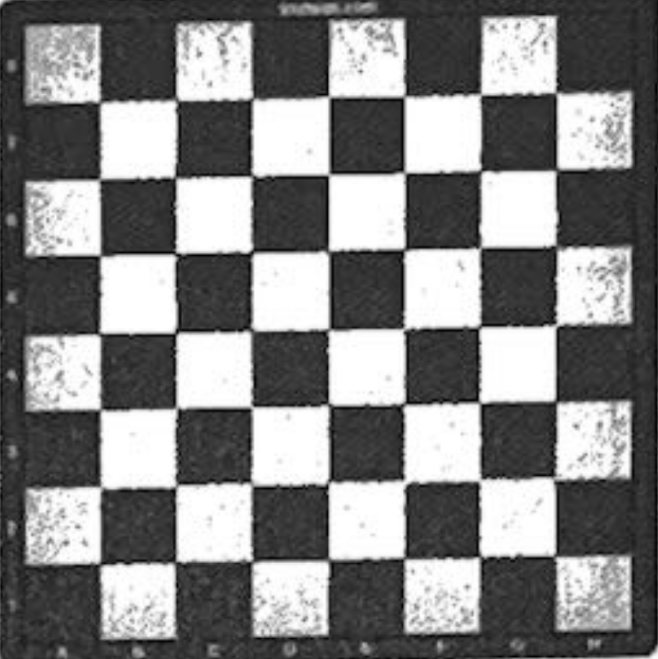
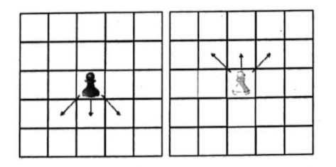
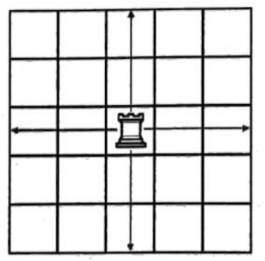
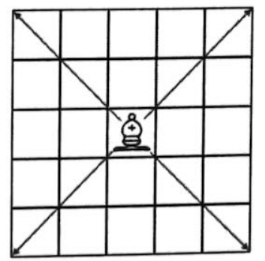
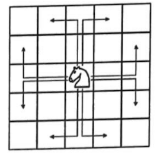
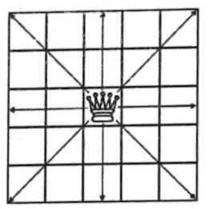
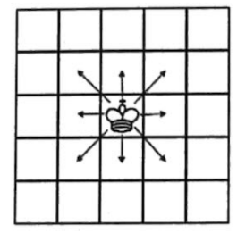

# Problem H. Hidden Pieces

**ICPC 2024/2025: Georgian Regional Contest**  
*Tbilisi, Kutaisi, Sunday, November 17, 2024*

### Input File: `standard input`  
### Output File: `standard output`  
### Time Limit: `1 second`  
### Memory Limit: `1024 mebibytes`  

---

Chess with fog of war (**"dark chess"**) differs from **regular chess** in that players **do not see the entire board**, but **only those squares that their pieces can reach**. You are given a **setup of pieces**, and you need to **determine what each player can see**.

In this problem, simplified rules of chess apply (including the setup of pieces), which differ from the actual rules of the game:

- The game is played on an **8 × 8** board, with squares colored in **black and white**, such that **no two squares sharing a border have the same color**. The **bottom-left square of the board is black**.  



- A **square** can either be **empty** or **occupied by a single piece**.  
- A **piece** has a **color** (**black or white**) and a **type** (**king, queen, knight, bishop, rook, pawn**).  
- Each side (**white and black**) **must have exactly one king** on the board.  
- Each side can have:
  - **0 to 8 pawns**
  - **0 to 2 rooks**
  - **0 to 2 knights**
  - **0 to 2 bishops**
  - **0 to 1 queen**
- If a player has **two bishops**, one must be on a **black square** and the other on a **white square**.
- **Pawns cannot be placed on the very bottom and very top ranks**.
- **Squares occupied by pieces of the same color are always visible** to the **player playing that color**.
- **Pieces cannot move off the board**.

### **Piece Movement Rules**
#### **Pawn Movement**
- A **black pawn** moves **one square down**.
- A **white pawn** moves **one square up**.
- A **pawn can capture a piece only if it is located in a square that shares exactly one point with the current square and is in the direction of the pawn's movement** ("diagonally forward").
- **A pawn sees both the square it can move to and the squares where it could capture a piece**, regardless of whether there is a piece there.  



#### **Rook Movement**
- A **rook** can move to any **free or occupied square of the opposite color** in the **same row or column**, provided there are no other pieces between it and that square.



#### **Bishop Movement**
- A **bishop** can move to any **free or occupied square of the opposite color** in **any of the four diagonal directions**, provided there are no other pieces between it and that square.



#### **Knight Movement**
- A **knight** can move to any **free or occupied square of the opposite color** that it can reach **by moving two squares in one direction and one square in a perpendicular direction**.




#### **Queen Movement**
- A **queen** can move to **any square** that a **bishop or rook of the same player** could move to **from the same square where the queen is located**.




#### **King Movement**
- A **king** can move to **any free or occupied square of the opposite color** that **shares at least one point** with the current square (**to any of the eight neighboring squares**).



---

## Input

- The input consists of **8 lines**, each containing **8 characters**.
- If a character is **`.`**, then the corresponding square is **empty**.
- If the character is a **lowercase letter**, then the piece is **white**.
  - `k` → **king**, `r` → **rook**, `q` → **queen**, `n` → **knight**, `b` → **bishop**, `p` → **pawn**.
- If the character is an **uppercase letter**, then the piece is **black**.
  - `K` → **king**, `R` → **rook**, `Q` → **queen**, `N` → **knight**, `B` → **bishop**, `P` → **pawn**.

---

## Output

- Output **two blocks** of **8 lines**, each containing **8 characters**:
  1. The **first block** corresponds to the **visibility of the board from the perspective of the white pieces**.
  2. The **second block** corresponds to the **visibility from the perspective of the black pieces**.

- Squares that **white cannot see** should be marked with `?`, while the other squares should contain the same pieces as in the input.
- Similarly, squares that **black cannot see** should be marked with `?`.

---

## Example

### **Input**
```
RNBKQBNR
PPPPPPPP
........
........
........
........
pppppppp
rnbkqbnr
```

### **Output**
```
????????
????????  
????????  
????????  
........  
PPPPPPPP  
rnbkqbnr  

RNBKQBNR  
PPPPPPPP  
........  
????????  
????????  
????????  
????????  
????????  
```

---

## **Explanation of the Example**
- **The first output block** represents what **white pieces can see**.
- **The second output block** represents what **black pieces can see**.
- The `?` characters represent **hidden squares**.

---
